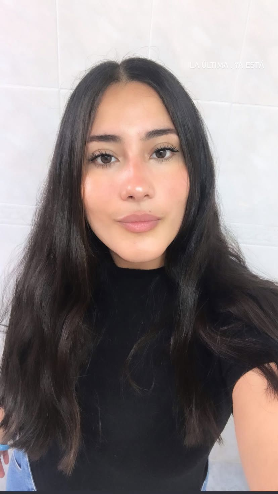

<!DOCTYPE html>
<html lang="es">
<head>
  <meta charset="UTF-8">
  <meta name="viewport" content="width=device-width, initial-scale=1.0">
  <title>Portafolio - Camila Chacón</title>
  
</head>
<body>

  <header>
    
    <h1>Camila Chacón</h1>
    
Bachiller en Educación • Estudiante de Comercio Exterior

  </header>

  <section>
    <h2>Sobre mí</h2>
    

      Me considero una persona responsable y ordenada, con deseos de seguir desarrollándome en el ámbito laboral. 
      Tengo experiencia trabajando tanto en equipo como de manera individual, y estoy dispuesta a aprender rápido.
    

  </section>

  <section>
    <h2>Contacto</h2>
    
<strong>Teléfono:</strong> 2622613508

    
<strong>Email:</strong> <a href="mailto:PAUCAMILACHACON@GMAIL.COM">PAUCAMILACHACON@GMAIL.COM</a>

    
<strong>País/Provincia:</strong> Argentina, Mendoza

    
<strong>Código Postal:</strong> 5560

    
<strong>Instagram:</strong> <a href="https://www.instagram.com/camcrh_/" target="_blank">@camcrh_</a>

    
<strong>Facebook:</strong> <a href="https://www.facebook.com/CamiHoran4/" target="_blank">Cami Horan</a>

  </section>

  <section>
    <h2>Estudios</h2>
    <ul>
      <li><strong>Primaria:</strong> Profesor Dionisio Chaca (2008 - 2014)</li>
      <li><strong>Secundario:</strong> Domingo Faustino Sarmiento (2015 - 2019) - Bachiller en Educación</li>
      <li><strong>Universidad:</strong> Comercio Exterior - Universidad de Congreso (2025 - 2029)</li>
    </ul>
  </section>

  <section>
    <h2>Idiomas</h2>
    <ul>
      <li>Inglés: Intermedio</li>
      <li>Español: Nativo</li>
    </ul>
  </section>

  <section>
    <h2>Habilidades</h2>
    <ul>
      <li>Microsoft Office</li>
      <li>Canva</li>
      <li>Meta Business Suite</li>
      <li>Sistemas operativos de reserva</li>
    </ul>
  </section>

  <footer>
    
© 2025 Camila Chacón - Portafolio Personal

  </footer>

</body>
</html>
